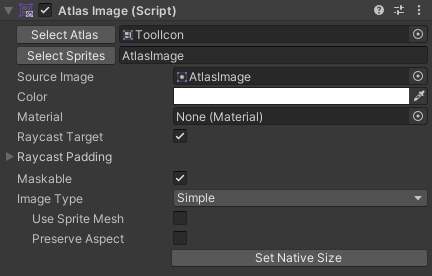
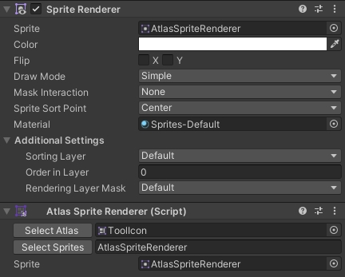
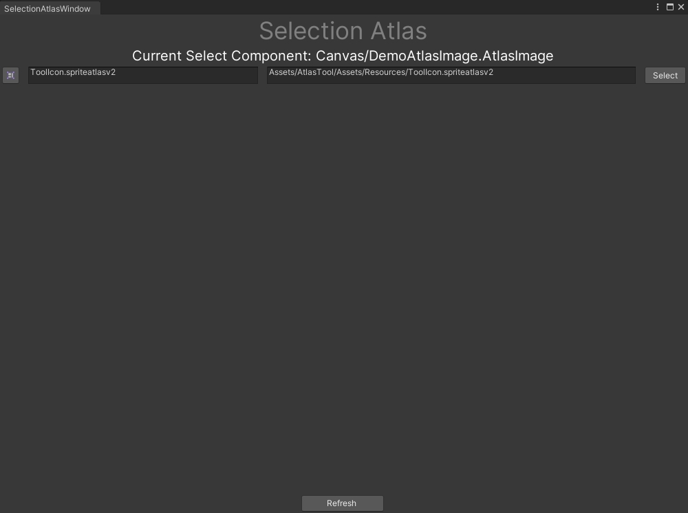
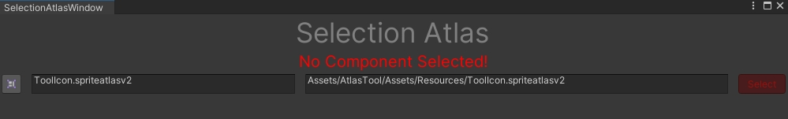
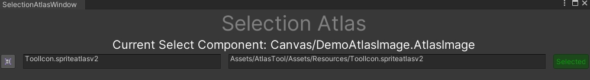
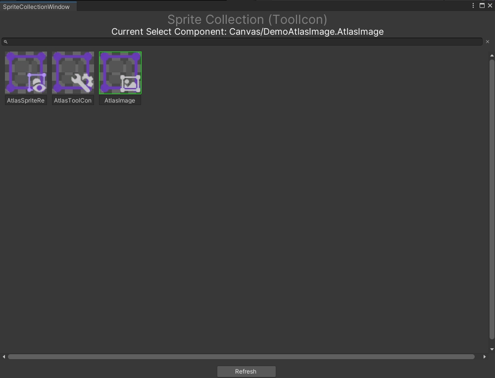
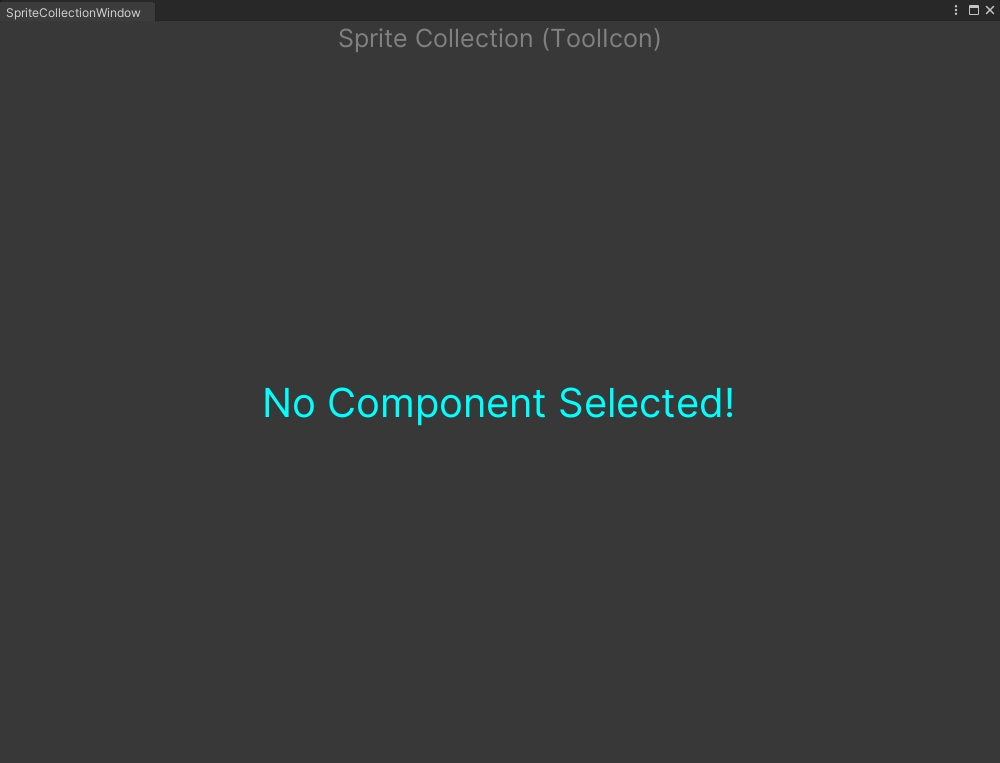

# Unity-AtlasTool (AtlasImage, AtlasSpriteRenderer)

## Conveniently select sprite assets in the atlas

[Download With Unity Asset Store](https://assetstore.unity.com/packages/slug/303904)
⚠️:Resources are being uploaded

### AtlasImage Component



You can open the "[SelectionAtlasWindow](#SelectionAtlasWindow )" by clicking the "Select Atlas" button. Click the "Select Sprites" button to open the "[SpriteCollectionWindow](#SpriteCollectionWindow)"


C# Member

```c#
public string SpriteName { get; private set; } //return sprite.name(If sprite is null, it will return null.)

public SpriteAtlas Atlas { get; private set; } //Modifying this value in the inspector panel will not affect the SpriteName and sprite mumbers

//AtlasImage inherits Image, you can still get Sprite through the AtlasImage.sprite member
public Sprite sprite; //Member In UnityEngine.UI.Image.cs (Changing the value will also change the SpriteName member.)
```


### AtlasSpriteRenderer Component



You can open the "[SelectionAtlasWindow](#SelectionAtlasWindow )" by clicking the "Select Atlas" button. Click the "Select Sprites" button to open the "[SpriteCollectionWindow](#SpriteCollectionWindow)"

:warning:This Component [RequireComponent(typeof(SpriteRenderer))] Because SpriteRenderer class is sealed.

C# Member

```c#
//The usage of the following three members is the same as that of the members in AtlasImage.
public string SpriteName { get; private set; }
public SpriteAtlas Atlas { get; private set; }
public Sprite Sprite { get; set; }
```


### SelectionAtlasWindow



This window will show all the atlas files in your project, including their paths.

:warning:If the window has no content, please click the "Refresh" button at the bottom

:warning:The window only displays the atlas files placed in the resources folder

The above will preview your currently selected GameObject including its full path in the scene.

You can view the location of the atlas file by clicking the atlas button on the far left.

You can select the corresponding atlas by clicking the "Select" button on the far right.

##### :exclamation: If you do not select a GameObject in the scene or the selected GameObject does not contain the two components of this plug-in, the window will display the following style:



##### :exclamation: If this component selects the atlas, the following style will be displayed:



### SpriteCollectionWindow



This window will display all the sprites in the atlas.

:warning:You need to set your sprite to Read/Write, otherwise it will not be displayed in the window.

:warning:If the window has no content, please click the "Refresh" button at the bottom

The above will preview your currently selected GameObject including its full path in the scene.(The title will show the current atlas name.)

The selected sprite will be marked with a green frame

In order to help you quickly find the sprite you want, you can select it through the search box below the path text.

##### :exclamation: If you do not select a GameObject in the scene or the selected GameObject does not contain the two components of this plug-in, the window will display the following style:


